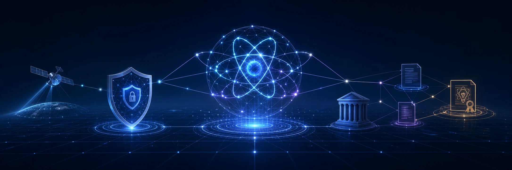
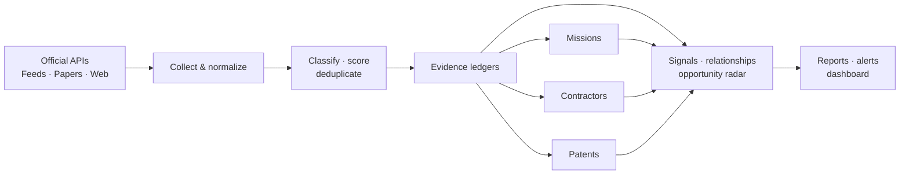

<p align="center">
  
</p>

<h1 align="center">Quantum Research Scout</h1>

<p align="center">
  <strong>Evidence-first intelligence for quantum technology, post-quantum security, federal missions, procurement, and patents.</strong>
</p>

<p align="center">
  <a href="https://raybeecham.github.io/quantum-research-scout/"><strong>Open the live dashboard</strong></a>
  ·
  <a href="reports/README.md">Browse reports</a>
  ·
  <a href="reports/alerts.md">Review alerts</a>
</p>

<p align="center">
  <a href="https://github.com/raybeecham/quantum-research-scout/actions/workflows/daily-research-scout.yml"></a>
  <a href="https://raybeecham.github.io/quantum-research-scout/"></a>
  
  
</p>

Quantum Research Scout turns a noisy stream of papers, standards, government announcements, acquisition notices, patents, and industry updates into a focused intelligence picture. It runs automatically, preserves source provenance, labels inference, and publishes everything as GitHub-native reports plus a static visual dashboard.

It is designed to answer four practical questions:

1. What changed?
2. Why does it matter?
3. Which organizations, technologies, and missions are connected?
4. What deserves attention next?

## At a Glance

| Intelligence layer | What it provides |
|---|---|
| **Strategic radar** | Daily evidence, persistent themes, momentum, importance, confidence, and actionable conditions |
| **Federal execution** | Missions connected to awards, grants, BAAs, RFIs, contractors, milestones, and relevant patents |
| **Procurement intelligence** | Ranked opportunities, bounded document extraction, amendment detection, and provisional qualification briefs |
| **Patent intelligence** | Applications and grants grouped by explicit family evidence, with legal status, citations, and strategic significance |
| **Organization tracking** | Entity profiles, public PQC-readiness evidence, source coverage, and peer relationships |
| **Operational trust** | Source reliability, freshness, disabled-source visibility, warning history, and confidence labels |

## From Source to Decision



The system favors explainable evidence over black-box conclusions. Exact relationships retain their source; analytical relationships retain their basis and confidence.

## Explore the Intelligence

| View | Best for |
|---|---|
| [**Visual dashboard**](https://raybeecham.github.io/quantum-research-scout/) | Fast scanning, trends, ranked opportunities, missions, patents, and organization profiles |
| [**Report index**](reports/README.md) | Latest daily, weekly, and monthly briefings |
| [**Signal tracker**](reports/signals.md) | Themes that are rising, stable, declining, actionable, watching, or stale |
| [**Federal missions**](reports/federal-missions.md) | Named national initiatives, milestones, agencies, relationships, and updates |
| [**Funding and procurement**](reports/federal-funding.md) | Awards, grants, acquisition notices, contractors, and mission execution |
| [**Contractor enrichment**](reports/contractor-enrichment.md) | Public SAM.gov registrations, UEIs, CAGE codes, business types, NAICS, and corporate hierarchy |
| [**Decision briefs**](reports/bid-no-bid.md) | Provisional opportunity qualification, risks, unknowns, and recommended actions |
| [**Pursuit workspace**](reports/pursuits.md) | Public-safe stages, owners, milestones, checklists, and upcoming decisions |
| [**Procurement documents**](reports/procurement-intelligence.md) | Requirements evidence, evaluation criteria, deadlines, contacts, and amendments |
| [**Patent intelligence**](reports/patents.md) | Patent families, stage, status, citations, assignees, and significance |
| [**Intelligence alerts**](reports/alerts.md) | New critical conditions, opportunity deadlines, amendments, and source problems |

## What Makes It Different

### Evidence stays attached

Scores, signals, mission links, contractor relationships, and alerts retain supporting URLs and explicit reasoning. Inferred connections are not presented as established facts.

### Government activity gets priority

White House, federal agency, standards, cybersecurity, mission, funding, and procurement evidence receives elevated attention. USAspending and Grants.gov work without credentials; SAM.gov adds acquisition notices and public solicitation links when configured.

### Procurement goes beyond opportunity listings

The acquisition layer can:

- rank open grants, BAAs, RFIs, and solicitations;
- resolve contractors using UEIs, CAGE codes, and conservative aliases;
- enrich exact entity matches with public SAM.gov registration, business-type, NAICS, PSC, and parent-organization evidence;
- extract bounded evidence from public PDF, DOCX, HTML, JSON, XML, and text documents;
- detect newly observed amendments and content changes;
- produce provisional qualification briefs with risks, unknowns, and next actions;
- move selected opportunities into an owner, milestone, checklist, and decision workflow.

Raw solicitation files and full document text are not retained. Qualification briefs support human review; they are not authorized bid/no-bid decisions.

Organization capability data and private pursuit notes stay local by default. The generated public dashboard only receives explicit public-safe pursuit fields; private configuration and working views are gitignored.

### Patents are treated as signals—not proof

Patent records can reveal technical investment and IP positioning. They do not prove implementation, validity, deployment, infringement, commercial readiness, or freedom to operate. Family grouping occurs only when explicit continuity evidence is available.

## Quick Start

```bash
git clone https://github.com/raybeecham/quantum-research-scout.git
cd quantum-research-scout
python -m venv .venv
python -m pip install -e .
```

Activate the environment:

```powershell
# Windows PowerShell
.\.venv\Scripts\Activate.ps1
```

```bash
# macOS or Linux
source .venv/bin/activate
```

Preview collection without writing reports or the database:

```bash
pqc-quantum-research-agent --config sources.yaml --dry-run
```

Run the scout and refresh the intelligence ledgers:

```bash
pqc-quantum-research-agent \
  --config sources.yaml \
  --reports-dir reports \
  --update-intelligence-tracking \
  --update-report-index
```

The installable command retains the original package name: `pqc-quantum-research-agent`.

## Automation

| Workflow | Schedule | Result |
|---|---|---|
| **Daily research scout** | Daily at `00:00 UTC` | Collects evidence, writes the digest, refreshes ledgers and alerts, and prunes daily reports older than 30 days |
| **Weekly synthesis** | Friday at `08:00 America/Chicago` | Consolidates Monday through Friday morning into a deterministic weekly briefing |
| **Monthly synthesis** | First day of each month | Consolidates the completed operational month |
| **Historical backfill** | Sunday at `03:00 UTC` | Refreshes bounded official-source history and readiness evidence without triggering retroactive alerts |
| **Pages deployment** | After intelligence workflows and relevant pushes | Rebuilds the static dashboard with versioned assets |

Core collection requires no paid AI service. Optional repository secrets unlock additional official data:

| Secret | Enables |
|---|---|
| `SAM_GOV_API_KEY` | SAM.gov notices, solicitation links, entity registrations, UEIs, CAGE codes, and procurement document intelligence |
| `USPTO_ODP_API_KEY` | Automated USPTO patent-publication discovery |

Slack, Teams, generic webhook, email, and GitHub Issue notification routes are independently configurable in [`alerts.yaml`](alerts.yaml).

## Configure Your Scout

- [`sources.yaml`](sources.yaml) — collectors, search queries, document limits, and source definitions
- [`missions.yaml`](missions.yaml) — federal missions, relationships, milestones, and discovery rules
- [`watchlists.yaml`](watchlists.yaml) — organizations, agencies, standards, algorithms, and technologies
- [`alerts.yaml`](alerts.yaml) — alert thresholds and delivery behavior
- [`pursuits.yaml`](pursuits.yaml) — public-safe pursuit status and automatic candidate seeding
- [`capabilities.example.yaml`](capabilities.example.yaml) — template for a private organization capability profile
- [`pursuits.example.yaml`](pursuits.example.yaml) — template for a private pursuit workspace
- [`readiness.yaml`](readiness.yaml) — public PQC-engagement stages and evidence rules
- [`standards.yaml`](standards.yaml) — authoritative standards, policy, and migration milestones
- [`source_weights.yaml`](source_weights.yaml) and [`keyword_weights.yaml`](keyword_weights.yaml) — optional scoring adjustments

Run `pqc-quantum-research-agent --help` for the complete CLI reference, including daily backfills, rolling lookbacks, weekly and monthly generation, retention, and score controls.

For organization-specific fit and internal pursuit management, copy the example files to `capabilities.local.yaml` and `pursuits.local.yaml`. Those files—and generated `.local-intelligence/` views—are excluded from Git. Keep `publish_fit_assessment: false` unless the capability assessment is intentionally approved for the public reports and dashboard.

<details>
<summary><strong>How to read the labels</strong></summary>

| Label | Meaning |
|---|---|
| **Rising** | Recent seven-day evidence is materially higher than the prior seven days |
| **Stable** | Evidence did not move enough to meet rising or declining thresholds |
| **Declining** | Recent evidence is materially lower than the prior period |
| **Critical / High / Medium** | Strategic importance derived from the strongest supporting evidence |
| **Actionable** | High- or critical-importance evidence with rising momentum |
| **Watching** | Relevant evidence without a current action trigger |
| **Stale** | No supporting evidence has appeared for more than 14 days |

These labels prioritize review. They do not replace the underlying evidence.

</details>

<details>
<summary><strong>Repository map</strong></summary>

```text
pqc_quantum_research_agent/  collection, scoring, ledgers, and report generation
dashboard/                   static GitHub Pages source
reports/                     generated briefings and structured intelligence
scripts/                     dashboard, backfill, and notification utilities
.github/workflows/           daily, weekly, monthly, backfill, and deployment automation

sources.yaml                 collection and query configuration
missions.yaml                federal mission portfolio
watchlists.yaml              tracked organizations and technologies
alerts.yaml                  alert and delivery policy
```

</details>

## Method and Guardrails

- Source reputation cannot promote unrelated content without topical evidence.
- Public-source relationships distinguish exact matches from analytical inference.
- Historical backfill enriches profiles but is structurally excluded from alerts.
- Daily reports use America/Chicago operational dates and retain 30 days; weekly and monthly syntheses remain available.
- Empty or rate-limited sources do not stop the remaining collection run.
- Human review remains essential for procurement decisions, patent interpretation, readiness claims, and strategic conclusions.

---

<p align="center">
  Built as a transparent, GitHub-native research system: inspect the evidence, challenge the inference, and improve the watch.
</p>
