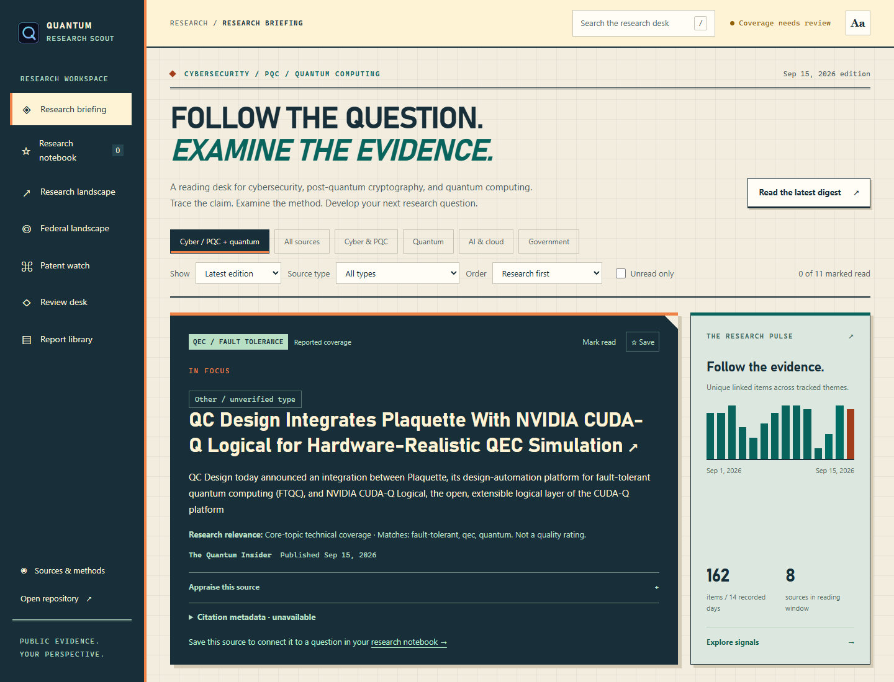

# Quantum Research Scout

### Follow the question. Examine the evidence.

A research desk for **cybersecurity, post-quantum cryptography, and quantum computing**.
Read new work, question its assumptions, and develop your own source-linked research notebook. Keep policy, missions, funding, organizations, and patents in view as supporting context.

**[Open the research desk →](https://raybeecham.github.io/quantum-research-scout/)** · [Browse reports](reports/README.md) · [How it works](docs/METHODOLOGY.md)

[](https://raybeecham.github.io/quantum-research-scout/)

*An actual published-data snapshot, not a mockup. The live desk changes as new reports arrive.*

## Start with a question

| What you want to know | Where to go |
|---|---|
| What is worth reading? | **[Research briefing](https://raybeecham.github.io/quantum-research-scout/#briefing)** — cyber/PQC and quantum focus, source-type filters, excerpts, and critical reading prompts |
| How does this inform my research? | **[Research notebook](https://raybeecham.github.io/quantum-research-scout/#saved)** — your question, critical appraisal, next step, and portable exports |
| Where is government moving? | **[Federal landscape](https://raybeecham.github.io/quantum-research-scout/#federal)** — missions, grants, acquisition notices, awards, and contractors |
| Who is investing in the technology? | **[Patent watch](https://raybeecham.github.io/quantum-research-scout/#patents)** — searchable applications and grants, family evidence, and strategic relevance |
| How does the field connect? | **[Research landscape](https://raybeecham.github.io/quantum-research-scout/#research)** — technology trends, organization profiles, and PQC readiness |
| What needs a second look? | **[Review desk](https://raybeecham.github.io/quantum-research-scout/#decisions)** — evidence changes, amendments, conflicts, and testable forecasts |
| Can I trust the coverage? | **[Sources & methods](https://raybeecham.github.io/quantum-research-scout/#operations)** — source health, collection gaps, evidence admission, and label definitions |

Start with the **latest edition**, or widen the view to **Past 7 days**. **Research first** prioritizes core papers and technical findings with visible match reasons; government-priority and chronological views remain available. Search with **/**, save sources to annotate, and use **Aa** for larger text. Notes stay in your browser: export a JSON backup and restore it with a non-overwriting import preview. Citation exports include retrieved repository metadata where available, with missing fields and peer-review uncertainty kept explicit.

## What makes it useful

**Evidence, then interpretation.** Original links and publication dates stay attached. Review prompts are labeled separately from source excerpts. Related headlines are grouped for reading—not counted as independent confirmation.

**Critical reading, not automatic conclusions.** Preprints are explicitly labeled; peer review is not inferred. Prompts ask about threat models, baselines, assumptions, and reproducibility. Your appraisal stays separate from the source. This is a discovery aid, not an exhaustive literature review or a novelty assessment.

**Context beyond the headline.** Follow a government initiative into funding, procurement, technical requirements, and patent activity. Exact matches and inferred relationships remain distinguishable.

**A visible record of uncertainty.** Old discoveries are not fresh events. Passed milestone dates are not proof of completion. Forecasts remain hypotheses, and patent filings are not evidence of deployment.

[Read the evidence rules and limitations →](docs/METHODOLOGY.md)

## Run it locally

Python 3.10+ is required. No API key is needed to preview the checked-in intelligence:

```bash
git clone https://github.com/raybeecham/quantum-research-scout.git
cd quantum-research-scout
python -m pip install -e ".[dev]"
python scripts/build_dashboard.py --output site
python -m http.server 8765 --bind 127.0.0.1 --directory site
```

Open [localhost:8765](http://localhost:8765). The dashboard is static HTML, CSS, and JavaScript—no frontend build system or paid AI service required.

Collection runs daily. Weekly synthesis covers Monday through **Friday at 8:00 a.m. America/Chicago**; monthly reports provide the longer view. The page shows the report edition separately from collection health and site build time.

[Collection, schedules & API keys](docs/OPERATIONS.md) · [Reading-desk guide](docs/READING-DESK.md) · [Development & tests](CONTRIBUTING.md)

**Optional AI research assistance:** The Question Lab can use a private local server or an invite-only hosted backend with GitHub sign-in, Gemini/Groq assistance, and paper discovery. Hosting is disabled until configured; keys stay server-side and notebook notes stay in your browser. [Setup, safeguards & testing →](docs/HOSTED-LAB.md)

## Make it your own

Edit [sources.yaml](sources.yaml) for coverage, [watchlists.yaml](watchlists.yaml) for organizations and technologies, and [missions.yaml](missions.yaml) for the federal portfolio. Optional SAM.gov and USPTO credentials belong in repository secrets or your local environment—never in committed files.

Public evidence powers the site. Private capability profiles, pursuit notes, and analyst feedback remain local by default. See the [operations guide](docs/OPERATIONS.md) before enabling private workflows or changing publication settings.

---

[MIT License](LICENSE) · [Report an issue](https://github.com/raybeecham/quantum-research-scout/issues) · Built for curious researchers who want the source, not just the score.
